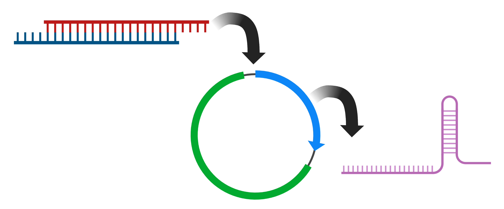

# CrisprOligoMaker


[](https://zenodo.org/badge/latestdoi/468099411)

<figure>

<figcaption align = "bottom" style=" text-align : right">image made in BioRender.com</figcaption>
</figure>


---

This Shiny app converts a Cas9 single guide RNA (sgRNA) sequence, without the NGG PAM, into upper and lower oligo sequences for cloning into Zhang Lab CRISPR plasmids that have undergone digestion with BbsI restriction enzyme. The app includes a text box with a description of what it does and a link to the instructions for cloning sgRNA oligos into pX330 plasmids. In addition to displaying the upper and lower oligo sequences, the app also outputs the complementary top and bottom strands, and displays them in a visually informative manner.

This app is built using the R Shiny package and can be run locally on a computer. To get started, open the app in R and enter a Cas9 sgRNA sequence (without the NGG PAM) in the text box. Then, click the "Submit" button to convert the sequence into upper and lower oligo sequences and complementary strands.

To Run in R Studio:
```
library(shiny)
library(magritrr)

# Run the app from the Github repository
shiny::runGitHub("SansamLab/CrisprOligoMaker")
```
